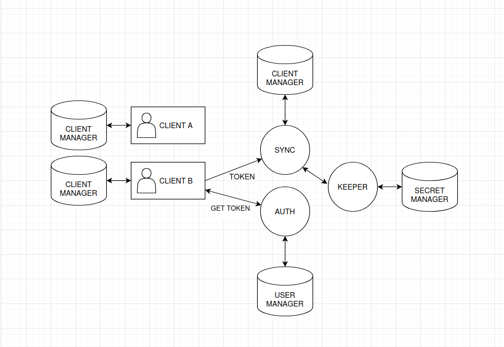

GophKeeper

### Схема сервисов


* Пользователь A работает в локальном режиме. Все секреты хранятся на его девайсе, шифрование происходит симметричными ключами GPG
*  Пользователь B проходит идентификацию с помощью Email привязанного к GPG ключам и Отпечатка GPG ключа, после авторизации пользователь получает токен, который используется в сервисе Sync, для отправки секретов в облако
  
### Генерация секрета для сервисов
```bash
go run cmd/auth/main.go --secret # записать вывод в .env
```

### Конфигурация клиента
```bash
gpg --full-generate-key # Генерация ключей
gpg --export -a "Имя профиля" > profiles/public-key.asc # Импорт публичного ключа
gpg --export-secret-keys -a "Имя профиля" > profiles/private-key.asc # Импорт приватного ключа

gophkeeper config set --key-path ./profiles/private-key.asc # Конфигурация путей для gpg ключа
# Установите прочие ключи
gophkeeper config set --help
```